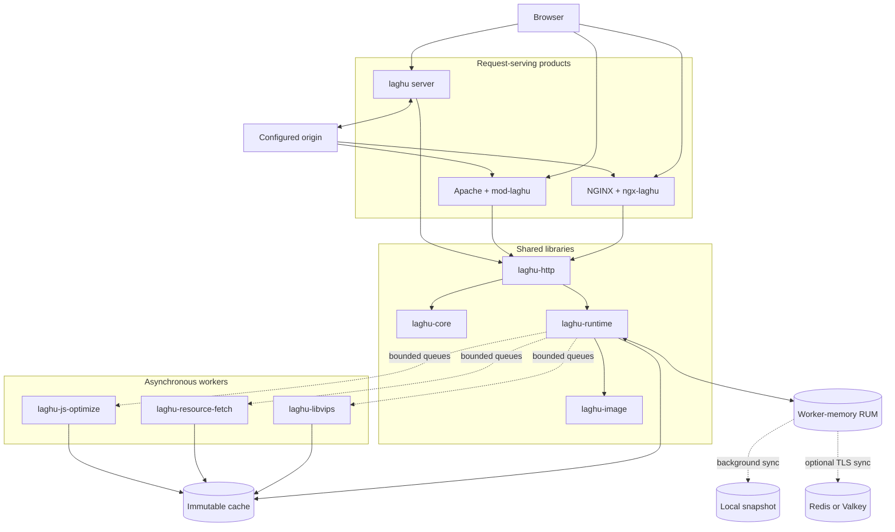

# Architecture

Laghu separates web-server integration, bounded request-path planning, and expensive asynchronous work. The diagram shows the deployed boundaries and the data that crosses them.

Requests consult memory and ready cache records only. Queue publication is non-blocking, workers validate derived output before atomic publication, and a cold, stale, invalid, or unavailable result leaves the origin response unchanged.

## Libraries

### `laghu-core`

Owns configuration merge, presets and rewrite levels, response eligibility, policy keys, SHA-256 variant keys, and the final never-larger selection rule.

### `laghu-http`

Defines the bounded server-neutral HTTP transaction contract used by all three products. It normalizes requests and responses, coordinates catalogs and queues, and returns body/header operations without NGINX or Apache types.

### `laghu-image`

Owns bounded image planning plus HTML and CSS image discovery. Codec execution remains in `laghu-libvips`.

### `laghu-runtime`

Owns HTML, CSS, and JavaScript planners; content catalogs; queue protocols; instrumentation; critical-resource learning; the memory-native RUM engine; snapshots; and optional Redis/Valkey synchronization.

## Modules

### `mod-laghu`

Integrates through Apache bucket brigades and configuration inheritance. It buffers only bounded eligible bodies and delegates policy to the shared libraries.

### `ngx-laghu`

Integrates through NGINX HTTP filters and memory pools. It does not perform codec or outbound-resource work in the event loop.

## Server

### `laghu`

The standalone server accepts HTTP/1.1 client traffic, connects to one configured HTTP or verified HTTPS origin, and runs the same `laghu-http` transaction engine. Its bounded worker pool is independent of the asynchronous optimization workers.

## State and Failure

The content-addressed cache contains validated immutable assets and checksummed catalogs. RUM observations are merged into per-process memory; a background thread persists local snapshots or synchronizes atomic batches through Redis/Valkey Lua. Request threads never read those backends directly. Queue saturation, corrupt state, worker loss, backend loss, parser rejection, or a larger candidate is a passthrough condition.

## Trust Boundaries

Only the external-font worker performs optimization-resource fetching, using verified HTTPS and exact host/path rules.
The standalone server separately connects to its configured origin, verifies HTTPS peers, and supports explicit CA configuration.
Browser beacons are same-origin, bounded, catalog-validated, and stored only as opaque aggregates.
