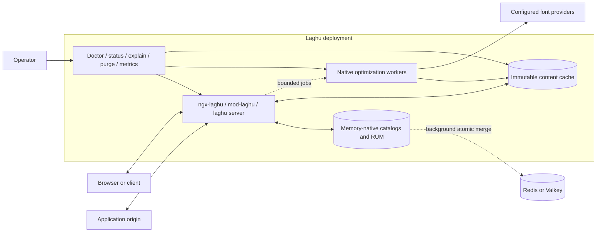
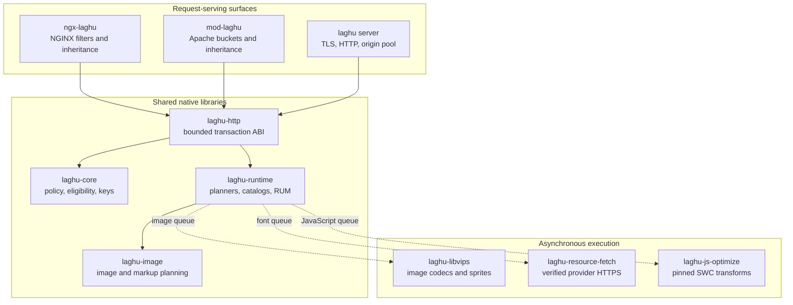
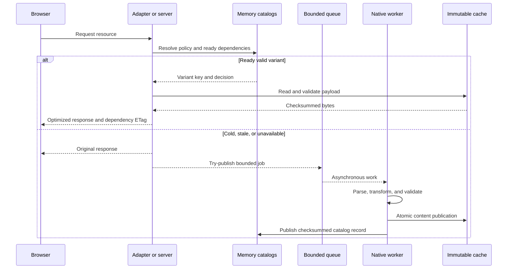

# Architecture

Laghu is a distributed optimization system with a deliberately small synchronous path.
Native adapters and the standalone server normalize traffic into one bounded transaction contract; shared planners make deterministic decisions from memory and immutable cache state; isolated workers perform expensive or network-capable work; and background synchronization shares anonymous learning across a fleet.

## System Context

This view shows who serves traffic, where state lives, and which components can perform network or codec work.

The request path does not wait for provider fetching, image encoding, JavaScript compilation, or RUM persistence.
Those boundaries are the basis of Laghu's fail-open behavior.

## Runtime Components

### `laghu-core`

`laghu-core` owns configuration merge, presets, rewrite levels, response eligibility, filter masks, policy keys, SHA-256 variant keys, and final acceptance gates.
It is the source of truth for cross-product policy semantics.

### `laghu-http`

`laghu-http` defines the server-neutral transaction ABI.
Inputs contain bounded normalized request, response, environment, cache, policy, and capability data; outputs contain an action, selected body, dependency validator, diagnostics, and bounded header operations.
No NGINX, APR, socket, TLS, or event-loop type crosses this boundary.

### `laghu-image`

`laghu-image` plans image transformations and discovers image dependencies in HTML and CSS.
It never owns a codec process or fetches an image from the network.

### `laghu-runtime`

`laghu-runtime` owns HTML/CSS/JavaScript planners, checksummed catalogs, immutable routes, queue publication, critical-resource learning, instrumentation endpoints, local snapshots, Redis/Valkey synchronization, cache administration, and operational decision records.

### `ngx-laghu` and `mod-laghu`

The native modules translate server configuration and response streams into the shared transaction contract.
They retain server-native inheritance, memory ownership, logging, lifecycle, and graceful reload behavior while keeping expensive work out of request-processing threads.

### `laghu` Server

The standalone server owns downstream TLS, HTTP/1.1, HTTP/2, HTTP/3, trusted forwarding, bounded connection queues, persistent origin pools, graceful drain, and the same transformation contract used by both modules.

## Request and Optimization Flow

The origin response always remains the fallback.
Workers cannot force request delivery of an invalid result because the serving process revalidates catalog version, checksum, policy, dependency key, content type, and size before selection.

## State, Consistency, and Lifecycle

| State | Owner | Consistency model | Recovery |
| --- | --- | --- | --- |
| Response policy | Adapter/server configuration | Reloaded immutable configuration | Reject invalid startup or reload |
| Ready variants | Content-addressed cache | Atomic publication and checksum validation | Republish from ordinary traffic |
| Resource catalogs | `laghu-runtime` | Versioned checksummed records | Reject corruption and relearn |
| RUM observations | Per-worker memory | Monotonic bounded merge | Snapshot/backend restore and expiry |
| Fleet RUM | Redis/Valkey | Idempotent atomic Lua batches | Retain pending deltas and retry |
| Decisions | Memory plus snapshot/backend | Versioned by template, policy, and optimizer | Invalidate on dependency/version change |

Request workers read only bounded local immutable catalogs; they never contact object storage, Redis, or Valkey to answer a request.
A background thread restores state, rotates bounded deltas, performs backend I/O, and reconciles returned aggregates into memory.

## Security Boundaries

- Native modules execute with their web-server process privileges and therefore treat all response parsing as privileged input handling.
- Codec and SWC workers accept bounded versioned jobs and publish only validated content-addressed output.
- `laghu-resource-fetch` contacts configured font providers, while `laghu-asset-upload` contacts the configured S3-compatible endpoint. Both require verified HTTPS and administrator-owned allowlists; neither exposes credentials to request workers.
- The standalone server verifies origin and downstream TLS according to administrator-owned trust configuration.
- Beacon endpoints require same-origin bounded JSON and store opaque aggregates rather than raw browser reports.
- Redis/Valkey credentials remain administrator-owned and never enter policy keys, snapshots, browser content, or normal diagnostics.

## Failure Domains

Queue saturation, worker crashes, timeouts, unavailable codecs, invalid provider CSS, parser rejection, cache corruption, Redis loss, expired learning, and unsupported CSP all disable only the affected optimization.
The original response remains deliverable.
Required-mode startup checks are reserved for operator-selected dependencies whose absence should prevent a process from accepting traffic.

## Deployment Topologies

Laghu supports a single host with local cache and snapshot, a replicated web tier with shared Redis/Valkey learning, an independent standalone optimization tier, and CDN/origin-shield deployments with immutable assets and cache-safe validators.
See the product integration guides for complete topologies and production configuration.
